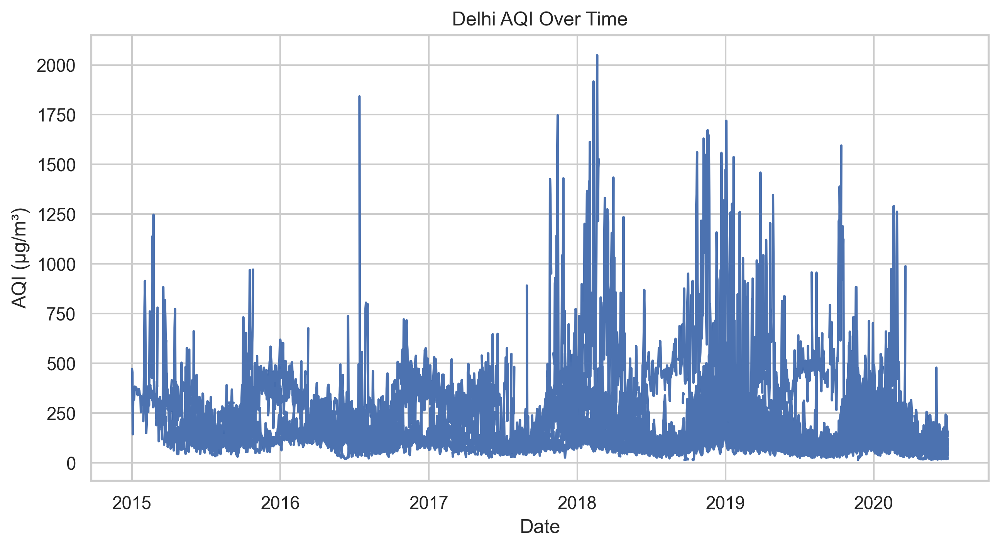
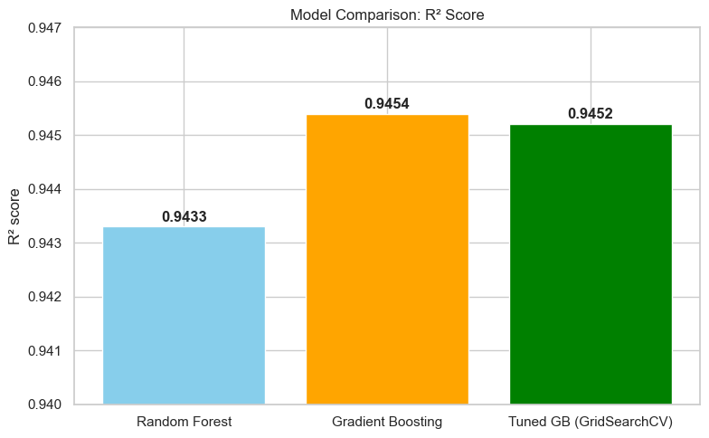
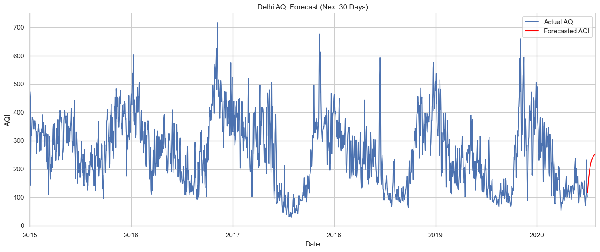

# Delhi AQI Forecasting Project

This project aims to analyze and forecast the Air Quality Index (AQI) of Delhi using both Time Series and Machine Learning models. The goal is to understand air pollution trends and predict future AQI levels for better environmental planning and health awareness.

## 📌 Overview

- 📅 **Dataset**: Daily AQI data for Delhi (2015–2020)
- 🧠 **Models Used**:
  - SARIMA (Seasonal ARIMA)
  - Random Forest Regressor
  - Gradient Boosting Regressor
  - Gradient Boosting with GridSearchCV (Tuned Model)
- 🎯 **Goal**: Predict AQI values and evaluate the effectiveness of different forecasting models

---

## 📊 Exploratory Data Analysis

We explored AQI trends over time using line plots and statistical summaries.



---

## 🤖 Machine Learning Models

Three ML models were trained and evaluated using the R² score metric:

- **Random Forest**
- **Gradient Boosting**
- **Tuned Gradient Boosting** (using GridSearchCV)

### 🔍 Model Comparison



- **Gradient Boosting (untuned)** achieved the best performance with an R² score of **0.9454**
- Tuned Gradient Boosting also performed well at **0.9452**

---

## ⏱️ Time Series Forecasting

SARIMA was used for forecasting the next 30 days of AQI values.



---

## 📂 Project Structure

```bash
📁 aqi-forecasting-delhi/
├── aqi_forecasting.ipynb         # Main Jupyter Notebook
├── README.md                     # Project overview
├── aqi_timeseries.png            # AQI over time plot
├── model_comparison.png          # ML model performance comparison
└── sarima_forecast.png           # SARIMA forecast plot
